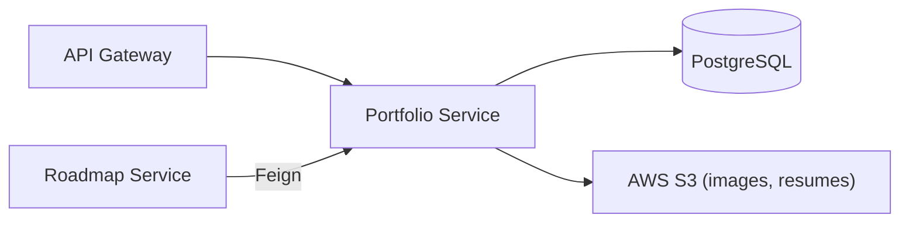

# 💼 Switchboard — Portfolio Service

Manages user professional portfolios — projects, skills, education, experience, certificates, and achievements. Profile images and resumes go to AWS S3. Portfolios are also accessible by email for cross-service lookups (used by the Roadmap Service via Feign).

`Java 17` `Spring Boot 3.5.6` `PostgreSQL` `AWS S3` `Prometheus`

## Architecture



## Key Decisions
| Decision | Choice | Why |
|---|---|---|
| File storage | AWS S3 | Resumes and images separate from relational data |
| Email lookup | `/portfolio/email/{email}` | Cross-service access without shared DB |
| Audit tracking | `AuditEntity` base class | Consistent `created_at` / `updated_at` across all entities |

## Endpoints
```
POST   /api/v1/portfolio/            create (multipart)
GET    /api/v1/portfolio/me          my portfolio
GET    /api/v1/portfolio/{id}        by ID
GET    /api/v1/portfolio/email/{e}   by email
PUT    /api/v1/portfolio/{id}        update
DELETE /api/v1/portfolio/{id}        delete

# Sub-resources follow the same CRUD pattern:
/api/v1/skills, /api/v1/projects, /api/v1/education,
/api/v1/experience, /api/v1/certificates, /api/v1/achievements
```

## Running
```bash
./mvnw spring-boot:run
# Needs: PostgreSQL, AWS S3
# Depends on: service-discovery :8761, config-server :8888
```
Swagger UI: `http://localhost:<port>/swagger-ui.html`
